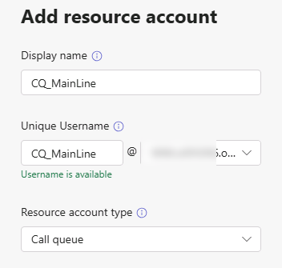
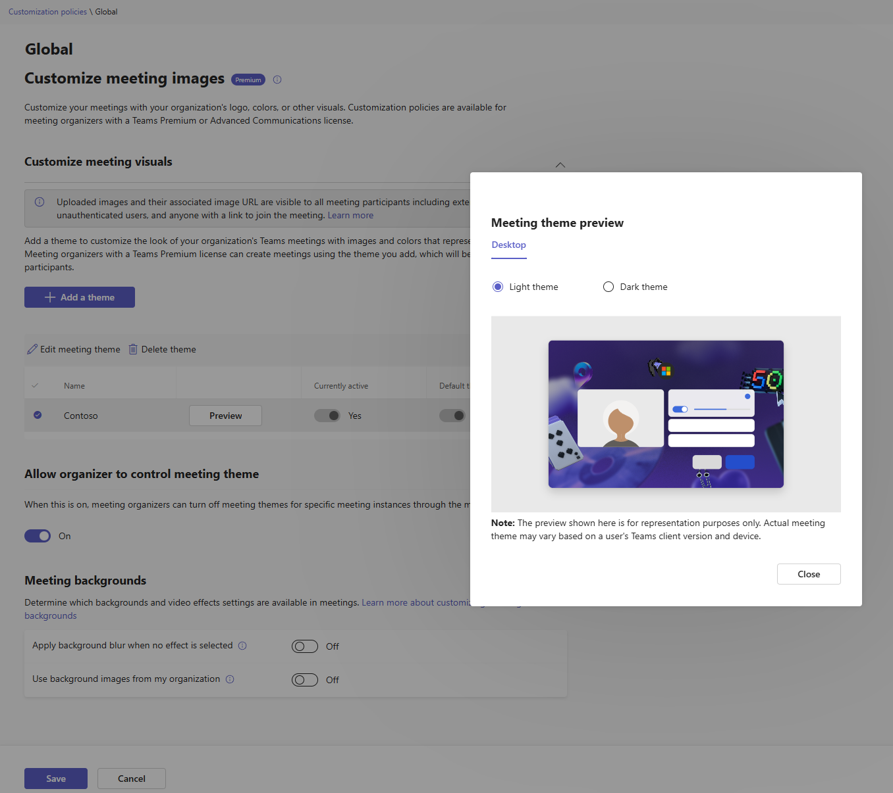

---
lab:
    title: 'Lab 06: Manage Microsoft Teams Premium'
    type: 'Answer Key'
    module: 'Learning Path 02: Manage Teams collaboration communications systems'
---

# Lab 06: Manage Microsoft Teams Premium
# Student lab answer key

## Lab Scenario

As part of the expanding business, the organization has began needing access to more specialized areas of Microsoft Teams for different departments.

## Lab Duration

  - **Estimated Time to complete**: 120 minutes

## Instructions

> [!IMPORTANT]
> Throughout this lab, you will use PowerShell cmdlets that must be customized for your specific lab configuration. In the instructions below, when you see &lt;LAB NUMBER&gt; in a PowerShell command, you should replace it with the LAB NUMBER obtained in Lab 3, Exercise 1, Task 2.
> You will also see &lt;TENANT NAME&GT; used in PowerShell commands and should replace it with the Microsoft 365 TENANT NAME (e.g. M365x01234567) for your Microsoft 365 account.

## Exercise 1: Setup and Configure the Queues App and Voice Application Policies

### Exercise Duration

  - **Estimated Time to complete**: 45 minutes

In this exercise, you will enable users for access to the queues app and control permissions for end-users access to Auto Attendants & Call Queues with Voice Application policies.

### Task 1 - Assigning Teams Premium Licenses

In this task, you will sign into the Microsoft 365 admin center and Assign a Teams Premium license to a user that will later use the Queues App.

1. Connect to **MS721-CLIENT01** and sign in as **Admin**. 

1. In **Microsoft Edge**, browse to the Microsoft 365 admin center at [**https://admin.microsoft.com**](https://admin.microsoft.com/).

1. On the **Sign in** screen, enter the credentials of the Global Admin account of the **MOD Administrator** with the username and password provided to you.

1. When a **Save password** dialog is displayed, select **Never**.

1. When a **Stay signed in?** dialog is displayed, select **No**.

    > NOTE: You may get a prompt to **Let's keep your account secure**. Click **Next** on this prompt and setup 2-Factor Authentication with the Microsoft Authenticator app. 

1. In the left navigation, select **Users**, select **Active Users**, and then select **Megan Bowen.**

1. Select **Licenses and Apps** on the user card, assign the **Microsoft Teams Premium** license to the user account, and then click **Save changes.**

You have assigned a Teams Premium license to a user

### Task 2 - Creating Resource Accounts for Voice Applications

In this task, you will sign into the Microsoft Teams admin center and create a resource account for a Call Queue that you will later build. All Call Queues that will have a phone number assigned to them will require an underlying Resource Account. We will then license this account.

1. You are still signed in to MS721-CLIENT01 as “Admin” and signed into the **Microsoft Teams admin center** as **MOD Administrator**.

1. In the **Microsoft Teams admin center**, select **Voice** on the left menu, then select **Resource Accounts.**

1. Click **+ Add**, enter the following information, and then click **Save**:

	- **Display Name:** CQ_MainLine

	- **Unique Username:** CQ_MainLine@<Lab Domain>.onmicrosoft.com

	- **Resoure Account Type:** Call Queue

    

1. In **Microsoft Edge**, browse to the Microsoft 365 admin center at [**https://admin.microsoft.com**](https://admin.microsoft.com/).

1. In the left navigation, select **Users**, select **Active Users**, and then select **CQ_MainLine.**

1. Select **Licenses and Apps** on the user card, assign the **Microsoft Teams Phone Resource Account** license to the account, and then click **Save changes.**

You have successfully created a Teams Phone Resource Account for a Call Queue and licensed it accordingly.

### Task 3 - Creating a Call Queue

In this task, you will sign into the Microsoft Teams admin center and create a Auto Attendant.

1. You are still signed in to MS721-CLIENT01 as “Admin” and signed into the **Microsoft Teams admin center** as **MOD Administrator**.

### Task 4 - Configuring Voice Application Policies

In this task, you will sign into the Microsoft Teams admin center and create a Auto Attendant.

1. You are still signed in to MS721-CLIENT01 as “Admin” and signed into the **Microsoft Teams admin center** as **MOD Administrator**.

### Task 5 - Assigning Voice Application Policies

In this task, you will sign into the Microsoft Teams admin center and create a Auto Attendant.

1. You are still signed in to MS721-CLIENT01 as “Admin” and signed into the **Microsoft Teams admin center** as **MOD Administrator**.

## Exercise 2: Using the Queues App

### Exercise Duration

  - **Estimated Time to complete**: 30 minutes

In this exercise, you will create custom meeting templates with Microsoft Teams Premium licensing.

### Task 1 - Accessing the Queues App

In this task, you will sign into the Microsoft Teams client and access the Queues App.

1. You are still signed in to MS721-CLIENT01 as “Admin” and signed into the **Microsoft Teams admin center** as **MOD Administrator**.

## Exercise 3: Customizing Meetings with Teams Premium

### Exercise Duration

  - **Estimated Time to complete**: 15 minutes

In this exercise, you will create custom meeting templates for users that have Microsoft Teams Premium licensing. This will customize the meeting join experience for members of the meeting.

### Task 1 - Create a Meeting Customization Policy

In this task, you will sign into the Microsoft Teams admin center and modify the Global Meeting Customization policy so that organizers with a Teams Premium license can brand their Teams meeting join experience with their company's branding.

1. You are still signed in to MS721-CLIENT01 as “Admin” and signed into the **Microsoft Teams admin center** as **MOD Administrator**.

1. In the **Microsoft Teams admin center**, select **Meetings** on the left menu, then select **Customization Policies.**

1. Click on the **Global (Org-wide default)** policy, click the **+ Add a theme** button, set the following parameters, and then click **Save**:

	- **Meeting theme name:** Contoso

	- **Logo Light Theme:** [Logo.png](https://github.com/MicrosoftLearning/MS-721T00-Collaboration-Communications-Systems-Engineer/tree/main/Instructions/Labs/Labfiles/Logo.png)

	- **Logo Dark Theme:** [Logo.png](https://github.com/MicrosoftLearning/MS-721T00-Collaboration-Communications-Systems-Engineer/tree/main/Instructions/Labs/Labfiles/Logo.png)

  - **Images Light Theme:** [Logo.png](https://github.com/MicrosoftLearning/MS-721T00-Collaboration-Communications-Systems-Engineer/tree/main/Instructions/Labs/Labfiles/Theme.png)

	- **Images Dark Theme:** [Logo.png](https://github.com/MicrosoftLearning/MS-721T00-Collaboration-Communications-Systems-Engineer/tree/main/Instructions/Labs/Labfiles/Theme.png)

	- **Color Hex Code:** #2760C9

    

1. Back in the Global Meeting Customization policy, select **Preview** next to the Contoso meeting theme. You will now see what the meeting join experience will look like for your organizers that have a Teams Premium license. Click **Close** and then **Save** to apply to policy to all users.

    

You have successfully modified the Global meeting customization policy and applied it to users with Teams premium licensing.

### Task 2 - Create a Meeting as a Teams Premium User and validate the branding has applied.

In this task, you will sign into the Microsoft Teams admin center and modify the Global Meeting Customization policy so that organizers with a Teams Premium license can brand their Teams meeting join experience with their company's branding.

1. You